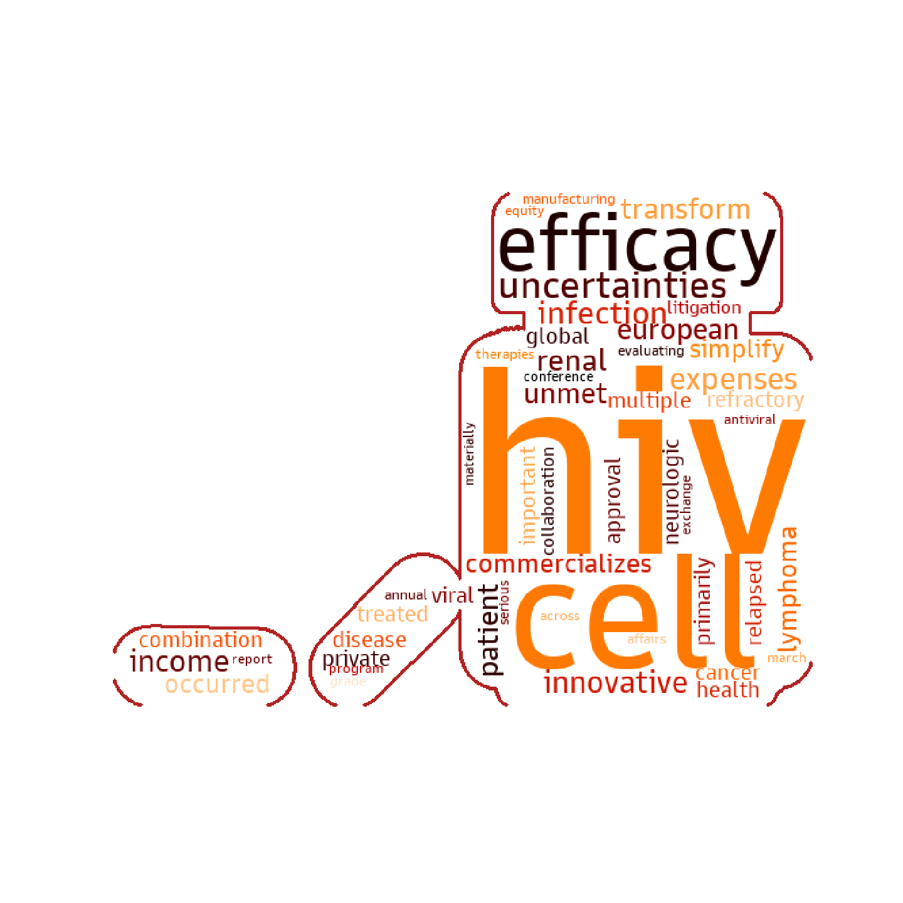

# Gilead-Analysis

## About
Gilead Sciences, Inc is an American biopharmaceutical company headquartered in Foster City, California that researches, develops and commercializes drugs, focusing primarily on antiviral drugs used in the treatment of HIV, hepatitis B, hepatitis C, and influenza, including Harvoni and Sovaldi. 
This project was created to assist Bencoolen Capital, the champion for HSBC Mergers and Acquisition 2020, to better understand the management focus and motivations of Gilead Sciences for the current year without having to go through the trouble of reading each press release in the year. Upon understanding the Gilead's management focus, they recommended the acquisition of Karyopharm Therapeutics, Inc. 
In this project, I used **web scrapping** to create a word cloud analysis on the press releases for the year to identify the focus of the written materials. 

### Visualization


Its current portfolio is highly dependent on HIV/AIDS segment which forms the bulk of its revenue by developing the Oncology profile.

From the words such as "commercializes", "innovative", "efficacy", "transform", we can understand that Gilead Sciences, Inc priortises clinical and commercial activities and focus on high quality science build upon core areas of strength and a corporate strategy Gilead could adopt is to diversify its existing portfolio.
### Top 5 most common words
```
from collections import Counter
top = dict(Counter(result).most_common(5))

print(top)
```
{'hiv': 192, 'cell': 131, 'efficacy': 124, 'uncertainties': 115, 'infection': 78}

## Built With
* Python 
* Web Scraping
* NLP
* Word Cloud
